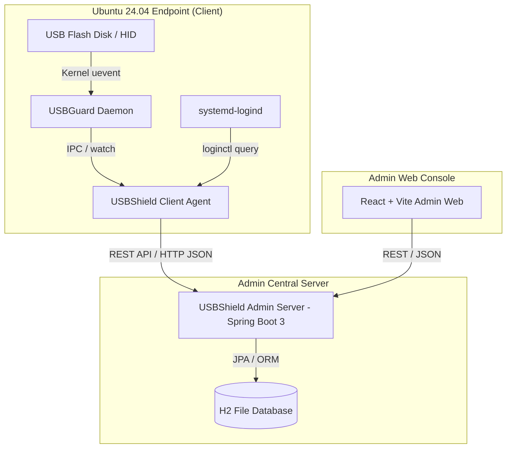
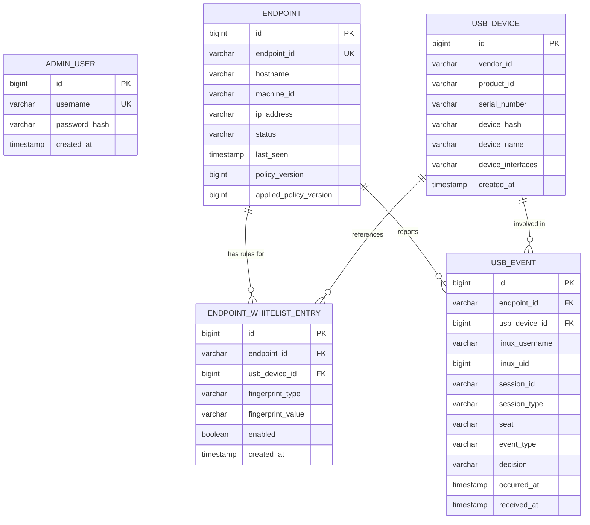

# USBShield Ubuntu — System Architecture Document (v0.1)

> **Dự án:** USBShield Ubuntu — Hệ thống ngăn chặn và quản lý USB Flash Disk trên Ubuntu  
> **Tài liệu:** Kiến trúc hệ thống tổng thể (System Architecture Document)  
> **Phiên bản:** v0.1 (Week 1 Contract Freeze)  
> **Owner:** Member 1 (Admin Server Lead & Architecture/Integration Owner)  

---

## 1. Tổng quan hệ thống (System Overview)

USBShield Ubuntu là giải pháp bảo mật Endpoint tập trung dành cho hệ điều hành Ubuntu (mục tiêu chính: Ubuntu 24.04 LTS amd64), giải quyết triệt để 2 bài toán cốt lõi:
1. **Ngăn chặn phần cứng:** Tự động chặn các thiết bị USB Flash Disk (Mass Storage - class `08`) chưa được cấp phép, đồng thời duy trì hoạt động bình thường của chuột/bàn phím (HID - class `03`).
2. **Active User Attribution:** Ghi nhận chính xác tài khoản Ubuntu có phiên đăng nhập local đang active tại thời điểm cắm USB, gửi cảnh báo về Admin Server trung tâm kèm quyết định `ALLOWED` hoặc `BLOCKED`.

Hệ thống hoạt động theo mô hình Client-Server tập trung trong mạng LAN (phòng lab, trường học, doanh nghiệp).

---

## 2. Các nguyên tắc kiến trúc cốt lõi (Core Architectural Principles)

### 2.1. Fail-Closed Principle (Nguyên tắc mặc định chặn)
- Chính sách cơ bản của USBGuard trên máy Client là **Reject/Block theo mặc định** đối với toàn bộ thiết bị USB Mass Storage (Class `08`).
- Chuột, bàn phím và các ngoại vi không phải lưu trữ được cấu hình trong Base Policy cho phép (`allow with-interface equals { 03:*:* }`).
- **Khả năng tự trị khi mất mạng (Offline Resilience):** Khi Agent mất kết nối tới Admin Server, daemon USBGuard trên máy trạm vẫn thực thi chính sách đã lưu cục bộ (`/etc/usbguard/rules.conf`). Agent sẽ spool các sự kiện vào outbox cục bộ và đồng bộ lại khi kết nối phục hồi.

### 2.2. Per-Endpoint Whitelist (Chính sách Whitelist theo máy trạm)
- **Tuyệt đối không sử dụng Global Whitelist (Allow-All):** Mỗi thiết bị USB khi được quản trị viên duyệt chỉ được cấp phép cho một hoặc một tập Endpoint cụ thể (`endpoint_id + device_identity`).
- **Ngăn ngừa rủi ro lây lan:** Một USB được whitelist tại máy Lab-01 không thể tự động cắm được vào máy Lab-02 trừ khi Admin chủ động gán quyền trên máy đó.
- **Phiên bản hóa chính sách (Policy Versioning):** Mỗi Endpoint có một số phiên bản chính sách `policyVersion` (Desired) và `appliedPolicyVersion` (Applied). Khi Admin thay đổi whitelist của máy nào, `policyVersion` của máy đó tăng lên 1, kích hoạt Agent kéo bản cập nhật qua cơ chế Heartbeat.

### 2.3. Active User Attribution (Định danh người dùng tại thời điểm sự kiện)
- USBShield xác định tài khoản Ubuntu local đang tương tác trực tiếp với máy tại khoảnh khắc USB được cắm thông qua `systemd-logind`.
- **Thông tin thu thập:**
  - `linuxUsername`: Tên tài khoản Ubuntu (VD: `student01`, `usbdev`).
  - `linuxUid`: User ID tương ứng (VD: `1000`).
  - `sessionId`: Mã session từ logind (VD: `2`, `21`).
  - `sessionType`: Loại session đồ họa (`wayland`, `x11`, hoặc `tty`).
  - `seat`: Vị trí tương tác phần cứng (mặc định `seat0`).
- **Fail-safe Ambiguity Rule:** Nếu tại thời điểm cắm USB không có session local active duy nhất (máy đang ở màn hình khóa, nhiều user SSH, hoặc không xác định rõ), hệ thống gán nhãn `UNKNOWN`. **Tuyệt đối không tự đoán mò (do not guess).**
- *Giới hạn kỹ thuật:* Hệ thống xác định phiên đăng nhập phần mềm active, không chứng minh bằng cơ học ai là người cầm tay cắm thiết bị.

---

## 3. Phân rã cấu trúc các thành phần (Component Breakdown)

| Thành phần | Công nghệ | Nhiệm vụ chính |
| :--- | :--- | :--- |
| **Client Agent** (`client-agent`) | Java 21, Spring Boot, systemd service | Lắng nghe sự kiện từ USBGuard IPC, tra cứu session active qua logind, gửi heartbeat/event lên Server, đồng bộ whitelist vào USBGuard rules. |
| **Admin Server** (`admin-server`) | Java 21, Spring Boot 3.3.x, Spring Data JPA, Security, H2 File Mode | Quản lý định danh Endpoint, lưu trữ lịch sử sự kiện, quản trị Per-endpoint Whitelist, cung cấp REST API cho Agent và Web Console. |
| **Admin Web Console** (`frontend`) | React, Vite, TypeScript | Giao diện dashboard cho quản trị viên theo dõi sự kiện thời gian thực, duyệt whitelist, xem trạng thái kết nối các máy trạm. |
| **Packaging & Enforcement** (`packaging`) | Debian package (`.deb`), USBGuard daemon | Đóng gói cài đặt trọn gói trên Ubuntu 24.04 LTS, cấu hình systemd service tự chạy và bảo vệ chống tắt trái phép. |

---

## 4. Mô hình dữ liệu quan hệ (Entity Data Model - H2 Database)

Admin Server sử dụng H2 Database ở chế độ File Mode (`./data/usbshield`) đảm bảo dữ liệu tồn tại bền vững qua các lần khởi động lại:

---

## 5. Luồng xử lý tích hợp (Integration Workflows)

### 5.1. Luồng phát hiện & chặn USB (Detection & Ingestion Flow)
1. Người dùng cắm USB vào máy trạm Ubuntu.
2. Kernel nhận diện và USBGuard daemon kích hoạt quy tắc kiểm tra.
3. Nếu USB không nằm trong rules cho phép, USBGuard lập tức **BLOCK** thiết bị ở tầng nhân.
4. `UsbGuardEventListener` trong Client Agent bắt được tín hiệu từ `usbguard watch`.
5. `ActiveUserResolver` truy vấn `systemd-logind` để lấy session local đang active (user, uid, session type).
6. Client Agent đóng gói `AgentEventRequest` và gửi `POST /api/agent/events` tới Admin Server.
7. Admin Server lưu trữ sự kiện vào bảng `usb_events` và thông báo tới Admin Console.

### 5.2. Luồng đồng bộ chính sách (Policy Synchronization Flow)
1. Định kỳ mỗi 15-30 giây, Client Agent gửi `POST /api/agent/heartbeat` chứa `currentPolicyVersion`.
2. Admin Server kiểm tra nếu `desiredPolicyVersion > currentPolicyVersion`, phản hồi yêu cầu đồng bộ.
3. Client Agent gọi `GET /api/agent/policy` kèm định danh máy qua header `X-Endpoint-Id`.
4. Admin Server chỉ trả về danh sách Whitelist được gán riêng cho máy đó.
5. Client Agent sinh luật tương thích với USBGuard, cập nhật file `/etc/usbguard/rules.conf` và nạp lại daemon.
6. Client Agent gửi `POST /api/agent/policy/ack` xác nhận đã áp dụng thành công phiên bản mới.

---

## 6. Kế hoạch hoàn thiện các tuần tiếp theo (Roadmap)

- **Week 1 (Hiện tại):** Khởi tạo Server skeleton, H2 file DB, Freeze DTO & Schema hợp đồng, Unit Test Jackson Parser.
- **Week 2:** Kết nối Agent ↔ Server thực tế, xử lý outbox spool khi mất mạng, triển khai logic Per-endpoint Whitelist Admin CRUD.
- **Week 3:** Hoàn thiện giao diện Admin Web Console (React), xác thực Admin Session, hoàn thiện gói `.deb` cài đặt Ubuntu.
- **Week 4:** Kiểm thử toàn diện trên phần cứng thật (Flash Disk, Chuột, Bàn phím), đóng gói tài liệu báo cáo và chuẩn bị kịch bản Demo.
